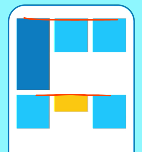
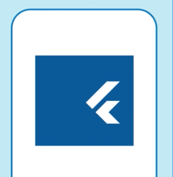

# widget
>1. Widgets 是用于构建UI的类.
>2. Widgets 用于布局和UI元素.
>3. 通过简单的widget来构建复杂的widget
---
### child、children属性
widget都有一个child属性（例如 `Center` 或`Container`；  
或者一个 children属性，
如： `Row`，`Column`，`ListView`或`Stack` 

---
## Row Column
* MainAxisAlignment（主轴） 和 CrossAxisAlignment（垂直主轴）
  .spaceEvenly 

  > 会在每个图像之间，之前和之后均匀分配空闲的水平空间。  
  > eg ： justify-content ：space-around  

  .center  

  >居中

* mainAxisSize: MainAxisSize.min,    

  > 元素聚集在一起    eg ： justify-content ：center；

## Container
...

下边是整理的一些google develop发布在youtube上的widget
---
> 地址：[Google Flutter](https://www.youtube.com/watch?v=lkF0TQJO0bA&list=PLOU2XLYxmsIL0pH0zWe_ZOHgGhZ7UasUE)
## SafeArea
> 可视界面：自动检测手机的通知栏,状态栏,圆角  

使用SafeArea的代码
```dart
class FlutterAlign extends StatelessWidget {
  @override
  Widget build(BuildContext context) {
    return SafeArea(
      child: Align(
        alignment: Alignment(-1, -1),
        child: Container(
          child: Text(
            "Hello",
          ),
        ),
      ),
    );
  }
}
```
对比效果如下: <br>
* 头部：<br>


* 底部：<br>


## Expanded
> 子元素自动缩放，相当于css flex布局

```dart
Row(
  children:[
    MyWidget(),
    Expanded(
      flex: 2,
      child: MyWidget(),
    ),
    MyWidget(),
    Expanded(
      child: MyWidget(),
    ),
  ]
)
```
对比效果如下: <br>


## Wrap
> 可换行布局，可横排（**默认**），竖排

```dart
Wrap(
  // direction: Axis.vertical (竖排),
  // alignment: WrapAlignment.end(倒序)
  childrens:[
    MyWidget(),
    ...
    MyWidget()
  ]
)
```
对比效果如下: <br>
* 横排（默认）：<br>

* 竖排：<br>


## AnimatedContainer
> 动画：某个属性值发生变化。
> 如：颜色，border，圆角，背景图，宽高，大小，阴影，padding等等

```dart
Widget build(BuildContext context) {
  return AnimatedContainer(
    color:_color,//(0xFF00BB00),
    duration:_myDuration,//持续时间
    child:MyWidget()
  )
}
// 触发
setState((){
  _color = Color(0xFF0000FF)
})
```

... 还有更多动画组件。。。

## Opacity
> 隐藏widget，保留其位置

```dart
final widgets = [
  MyWidget(Colors.green),
  Opacity(
    opacity:0.0,
    child:MyWidget(Colors.blue),
  ),
  MyWidget(Colors.yellow),
]
```
效果: (没有边框)<br>


> 遮罩层：使用Opacity将一个子部件与另一个子部件层叠在一起

```dart
Stack(
  childdren:[
    MyImageWidget(),
    Opacity(
      opacity:0.25,
      child:c,//0.25半透明
    ),
  ]
)
```

<br>
### AnimatedOpacity
> 带动画的Opacity
```dart
AnimatedOpacity(
  duration:_myDuration,//持续时间
  opacity: _myOpacity, //0.0
  child:MyWidget(Colors.blue),
)
//触发
setState(() =>
  _myOpacity = 0.25
)
```
## FutureBuilder
> 处理Future Widget ，在数据加载时显示的内容，加载后显示加载内容


<br>

```dart
FutureBuilder(
  future: http.get('http://www.baidu.com')
  builder:(context,snapshot) {
    if(snapshot.connectionState == ConnectionState.done){
      if(snapshot.hasError){ // 错误处理
        return WentWrong();
      }
      return AwecomeData(snapshot.data)
    }
  }else{
    return CircularProgressIndicator() //单词： 圆形的进度条
  }
)
```
## FadeTransition 
> 动画：淡入淡出。

```dart
FadeTransition(
  opacity:animation,
  child:Text("哈哈哈")
)
//创建持续时间： AnimationController
final controller = AnimationController(
  vsync:this,
  duration: Duration(seconds:2),
);
// 创建动画
Final animation = Tween(
  begin: 0.0,
  end:1.0,
).animate(controller);
// 启动动画
controller.forward();
// 清除
controller.dispose();
```
::: tip
  一般将FadeTransition包装在StatefulWidget，用于转场
:::

## FloatingActionButton(FAB)
> 浮动按钮

```dart
Scaffold(
  floatingActionButton: FloatingActionButton(
    child: Icon(Icons.add),
    onPressed:(){}
  )
)
```
如图：<br>

<br>
* 如何将FAB嵌入到底部导航栏（BNB）
```dart
Scaffold(
  bottomNavigationBar:...
  floatingActionButton: ...
  floatingActionButtonLocation:FloatingActionButtonLocation.centerDocked
)
```

<br>
## pageView
> 滑动切换每个屏幕内容（如：抖音。上滑下滑，或者左滑右滑(默认)）
```dart
final controller = PageController(
  initialPage: 1,//初始页
)

Final pageView = PageView(
  controller:controller,
  // scrollDirection:Axis.vertical,竖直活动
  children:[
    MyPage1Widget(),
    MyPage2Widget(),
    MyPage3Widget(),
  ]
)
```


## Table(表格)
> 表格(不可滚动)
::: tip
  可滚动的使用：<br>
 **GridView** 可滚动的widget网格
:::
```dart
Table(
  children:[
    TableRow(children:[
      MyWidget(),
      ...
    ]),
    TableRow(children:[
      MyWidget(),
      ...
    ]),
  ]
)
```
### 属性（部分）：
* 垂直对齐方式：
```dart
defaultVerticalAlignment:TableCellVerticalAlignment.top //上对齐
```

<br>
* 水平列相对宽度：
```dart
defaultColumnWidth:FractionColumnWidth(.25)//比列
defaultColumnWidth:FixedColumnWidth(30.0) //宽度
defaultColumnWidth:IntrinsicColumnWidth() // 原大小

// 为各个列设置特定行为
columnWidths:{1:FractionColumnWidth(.2)}
```
按比例：<br>

<br>

## SliverAppBar
> 在滚动时发生改变或者消失的AppBar

例如：<br>


* SliverAppBar和 `CustomScrollView` 一起使用
```dart
CustomScrollView(
  slivers:<Widget>[
    SliverAppBar(
      expandedHeight:200.0,
      flexibleSpace: FlexibleSpaceBar(
        background: _expandedImage, // 达到200高度时，展示的内容
      ),
      title: Text('SliverAppBar'),
      floating: true, //下滑时显示
    ),
    _oneSliver,
    _oneSliver,
    _oneSliver,
  ]
)
```


## SliverList & SliverGrid
> 可滚动的列表或网格 (一起列出网格和列表 或者 复杂的滚动效果)
::: tip
 一般的滚动使用**ListView** 和 **GridView**是最好的选择
:::

<br>
```dart
SliverList(
  delegate: SliverChildListDelegate( // 指定子项列表
    [
      MyWidget(),
      MyWidget(),
      MyWidget(),
    ]
  )
)
// 
delegate: SliverChildBuilderDelegate( //构建子元素
  (BuildContext context, int index){
    return aWidget
  }
)
// 委托
SliverList.count(
  children: scrollItem,
  crossAxisCount: 4, // 包含的项目数
)
//
SliverList.extent(
  children: scrollItem,
  crossAxisExtent: 90.0, // 最大宽度
)
```
## FadeInImage
> 图片(带占位符)
```dart
FadeInImage.assetNetwork(
  placeholder:'本地资源',
  image:'https://www.baidu.com',
)
```
```dart
FadeInImage.memoryNetwork(
  height:300.0,
  fadeInDuration: const Duration(seconds:1), //动画时长，
  fadeInCurve: Curves.bounceIn, // 动画方式
  placeholder:localImageBytes,
  image:'https://www.baidu.com',
)
```
```dart
 // 也可以这么写
FadeInImage(
    placeholder: AssetImage("images/placeholder.jpg"),
    image: NetworkImage(
        "https://flutter.io/images/catalog-widget-placeholder.png",
        headers: {"header": "value"}),
  )
);
```
## StreamBuild
> 倾听来自串流的事件，数据串流发出新的数据事件时重建它的子节点
> 数据串流：任何事件：点击，数据改变，或者 截图，Firebse数据，传感器事件，网络连接等事件

:::tip
StreamBuilder其实是一个`StatefulWidget`，它通过监听`Stream`，发现有数据输出时，自动重建，调用`builder`方法。
:::
```dart
StreamBuilder<T>(
    key: ...可选...
    stream: ...需要监听的stream...
    initialData: ...初始数据，否则为空...
    builder: (BuildContext context, AsyncSnapshot<T> snapshot){
        if (snapshot.hasData){
            return ...基于snapshot.hasData返回的控件
        }
        if (snapshot.hasError){
            return ...错误处理
        }
        return ...没有数据的时候返回的控件
    },
)
```
官网计数器done的例子
```dart
import 'dart:async';
import 'package:flutter/material.dart';

class CounterPage extends StatefulWidget {
  @override
  _CounterPageState createState() => _CounterPageState();
}

class _CounterPageState extends State<CounterPage> {
  int _counter = 0;
  final StreamController<int> _streamController = StreamController<int>();

  @override
  void dispose(){
    _streamController.close();
    super.dispose();
  }

  @override
  Widget build(BuildContext context) {
    return Scaffold(
      appBar: AppBar(title: Text('Stream version of the Counter App')),
      body: Center(
        child: StreamBuilder<int>(  // 监听Stream，每次值改变的时候，更新Text中的内容
          stream: _streamController.stream,
          initialData: _counter,
          builder: (BuildContext context, AsyncSnapshot<int> snapshot){
            return Text('You hit me: ${snapshot.data} times');
          }
        ),
      ),
      floatingActionButton: FloatingActionButton(
        child: const Icon(Icons.add),
        onPressed: (){
          // 每次点击按钮，更加_counter的值，同时通过Sink将它发送给Stream；
          // 每注入一个值，都会引起StreamBuilder的监听，StreamBuilder重建并刷新counter
          _streamController.sink.add(++_counter);
        },
      ),
    );
  }
}
```
## InheritedWidget && InheriteModel
> inherited widget就像对其他的Widget的一个实现或者说是补充，就像Theme.of(context)返回你能拿到一个ThemeData，`并使用其内部自定义的属性改变你当前widget的显示效果`。

> InheriteModel 可以决定只重构某个子Widget，而不是整个。

::: tip
以下转载这篇文章：[Flutter知识点: InheritedWidget](https://www.jianshu.com/p/387e2454d590/)
:::
1. 创建一个model，用于保存当前的计数值
```dart
class InheritedTestModel {
  final int count;
  const InheritedTestModel(this.count);
}
```
2.创建一个InheritedWidget
```dart
class InheritedContext extends InheritedWidget {
  
  //数据
  final InheritedTestModel inheritedTestModel;

  //点击+号的方法
  final Function() increment;

  //点击-号的方法
  final Function() reduce;

  InheritedContext({
    Key key,
    @required this.inheritedTestModel,
    @required this.increment,
    @required this.reduce,
    @required Widget child,
  }) : super(key: key, child: child);

  static InheritedContext of(BuildContext context) {
    return context.inheritFromWidgetOfExactType(InheritedContext);
  }

  //是否重建widget就取决于数据是否相同
  @override
  bool updateShouldNotify(InheritedContext oldWidget) {
    return inheritedTestModel != oldWidget.inheritedTestModel;
  }
}
```
3.把 "+" ,“-”, "value" 3个widget隔离
```dart
class TestWidgetA extends StatelessWidget {
  @override
  Widget build(BuildContext context) {
    final inheritedContext = InheritedContext.of(context);

    final inheritedTestModel = inheritedContext.inheritedTestModel;

    print('TestWidgetA 中count的值:  ${inheritedTestModel.count}');
    return new Padding(
      padding: const EdgeInsets.only(left: 10.0, top: 10.0, right: 10.0),
      child: new RaisedButton(
          textColor: Colors.black,
          child: new Text('+'),
          onPressed: inheritedContext.increment),
    );
  }
}


class TestWidgetB extends StatelessWidget {
  @override
  Widget build(BuildContext context) {

    final inheritedContext = InheritedContext.of(context);

    final inheritedTestModel = inheritedContext.inheritedTestModel;

    print('TestWidgetB 中count的值:  ${inheritedTestModel.count}');

    return  new Padding(
      padding: const EdgeInsets.only(left: 10.0, top: 10.0, right: 10.0),
      child:  new Text('当前count:${inheritedTestModel.count}',style: new TextStyle(fontSize: 20.0),),
    );
  }
}


class TestWidgetC extends StatelessWidget {
  @override
  Widget build(BuildContext context) {

    final inheritedContext = InheritedContext.of(context);

    final inheritedTestModel = inheritedContext.inheritedTestModel;

    print('TestWidgetC 中count的值:  ${inheritedTestModel.count}');

    return new Padding(
      padding: const EdgeInsets.only(left: 10.0, top: 10.0, right: 10.0),
      child: new RaisedButton(
          textColor: Colors.black,
          child: new Text('-'),
          onPressed: inheritedContext.reduce),
    );
  }
}
```
4. 组合
```dart
class InheritedWidgetTestContainer extends StatefulWidget {
  @override
  State<StatefulWidget> createState() {
    return new _InheritedWidgetTestContainerState();
  }
}

class _InheritedWidgetTestContainerState
    extends State<InheritedWidgetTestContainer> {
  InheritedTestModel inheritedTestModel;

  _initData() {
    inheritedTestModel = new InheritedTestModel(0);
  }

  @override
  void initState() {
    _initData();
    super.initState();
  }

  _incrementCount() {
    setState(() {
      inheritedTestModel = new InheritedTestModel(inheritedTestModel.count + 1);
    });
  }

  _reduceCount() {
    setState(() {
      inheritedTestModel = new InheritedTestModel(inheritedTestModel.count - 1);
    });
  }

  @override
  Widget build(BuildContext context) {
    return new InheritedContext(
        inheritedTestModel: inheritedTestModel,
        increment: _incrementCount,
        reduce: _reduceCount,
        child: new Scaffold(
          appBar: new AppBar(
            title: new Text('InheritedWidgetTest'),
          ),
          body: new Column(
            children: <Widget>[
              new Padding(
                padding: const EdgeInsets.only(left: 10.0, top: 10.0, right: 10.0),
                child: new Text('我们常使用的\nTheme.of(context).textTheme\nMediaQuery.of(context).size等\n就是通过InheritedWidget实现的',
                  style: new TextStyle(fontSize: 20.0),),
              ),
              new TestWidgetA(),
              new TestWidgetB(),
              new TestWidgetC(),
            ],
          ),
        ));
  }
}

```
效果:<br>


## ClipRRect
> 圆角：可以剪切图片...
```dart
new ClipRRect(
    borderRadius: BorderRadius.circular(6.0),
    clipBehavior: Clip.hardEdge,// 自定义样式，默认圆角
    child: new Image.asset(Utils.getImgPath('ali_connors')),
  )
```
## Hero
> Hero过度动画


```dart
// 源路由
Hero(
        tag: 'hero', //标签和目标路由相同
        child: Container(
          color: Colors.lightGreen,
          width: 50.0,
          height: 50.0,
        ));
```
```dart
// 目标路由
Hero(
        tag: 'hero', //标签
        child: Container(
          color: Colors.orange,
          width: 150.0,
          height: 120.0,
        ));
```
跳转路由逻辑
```dart
GestureDetector(
      child: Hero(
          tag: 'hero',
          child: Container(
             color: Colors.orange,
             width: 150.0,
             height: 120.0,
          )),
      onTap: () {
        Navigator.of(context).push(MaterialPageRoute(builder: (_) {
          return ElementDetailPage();
        }));
      },
    );
```
## CustomPaint
> 绘制:  绘制出各种各样的自定义图形。(Canvas)
::: tip
一个例子：<br>
查看这篇博客：[CustomPaint博客](https://juejin.im/post/5bdc11be518825171140d46d/)
:::

```dart
class ProgressPainter extends CustomPainter {
  @override
  void paint(Canvas canvas, Size size) {
      // 绘制代码
  }
  
  @override
  bool shouldRepaint(CustomPainter oldDelegate) {
    return true;
  }
}
```
## Tooltip
> 适用于障碍人士，长按可以发出声音。
```dart
ToolTip(
  message:'Dash',
  verticalOffset:48,// 下偏移
  height: 24,
  child: MyVisualWidget()
)
```

```dart
// 有些widget内置tooltip ，例如
IconButton(
  icon: Icon(Icon.high_quality),
  toopltip: 'High quality' //发出的声音的内容
)
```
## FittedBox 
> 自动缩放或者剪辑子项
```dart
MyBlueRect(
  child: FittedBox(
    alignment:Alignment.centerLeft,// 对齐方式
    fit：BoxFit.contain,// 缩放或者裁剪属性
    child:MyCatPic(),
  )
)
```


## LayoutBuilder
> LayoutBuilder会传入父组件的约束。我们就可以通过传入的约束，计算变化量。
> 例如：手机横屏时两排显示

```dart
Widget build(BuildContext context){
  return LayoutBuilder(
    builder:(context,constraints){
      if(constraints.maxWidth<600){
        return MyOneColumentLayout();//单排布局
      }else{
        return MyTwoColumentLayout(); //双排布局
      }
    }
  )
}

```

::: tip
参考博客：[Flutter开发实战分析-pesto_demo解析](https://juejin.im/post/5b717c006fb9a009ac557ed9/)
:::

## AbsorbPointer 
> 禁用屏幕控制，如点击，滑动等。

```dart
Widget build(BuildContext context){
  return AbsorbPointer(
    absorbing: false, // 控制是否禁用
    ignoringSemantics:false,//控制屏幕阅读器是否忽略被阻止的widget
    child:MyWidget(),
  )
}
```
### 扩展：其他widget的一些禁用事件
```dart
// 按钮不可点击
RaisedButton(
  color:Colors.blue,
  child:Text("Click me!"),
  onPressed: null,//设置为null
)
```
```dart
// ListView 不许滑动
ListView(
  NeverScrollableScrollPhysics:true,
  children:[],
)
```
## Transform
> 动画：自定义动画。

* 45°旋转
```dart
Transform.rotate(
  angle:pi/4, // 45 deg
  child:MyIcon(),
)
```
* 比例变大或者缩小
```dart
Transform.scale(
  angle:1.5,
  child:MyIcon(),
)
```
* 翻转
```dart
Transform.translate(
  offset: Offset(50,50),
  child:MyIcon(),
)
```
* 斜
```dart
c(
  transform: Matrix4.skewX(0.3),
  child:MyIcon(),
)
```

* 3D
```dart
Transform(
  transform: Matrix4.identity()
    ...setEntry(3,2,0.01)
    ...rotteX(0.6),
  alignment:FractionalOffset.center,
  child:MyIcon(),
)
```


# BackdropFilter
> 图片：模糊（打码），旋转，倾斜等

```dart
stack(
  children:[
    DashWidget,
    // 部分模糊 如 下图 右
    positioned(
      top:100,bottom:150,left:200,right:100,
      child:BackdropFilter(
        ...
      )
    )
  ]
)

stack(
  children:[
    DashWidget,
    // 全部模糊 如 下图
    positioned.fill(
      child:BackdropFilter(
        ...
      )
    )
  ]
)

// ...
BackdropFilter(
  filter: ImageFilter.blur( // 过滤器的类型：模糊或者矩阵
    sigmaX:5,
    sigmaY:5,
  )
  child: Container( // 若过滤器是背景 child可设置 空容器
    color: Colors.black.withOpacity(0),
  )
)
```


## Align
> widget 在容器中的位置

```dart
Container(
  child: Align(
    alignment: Alignment.bottomRight // topLeft  centerRight 等等值
    child:Text('Hello')
  )
)
```

<br>
* 也可以更精准的放置

如图，将父容器分为如下坐标<br>

<br>
```dart
Container(
  child: Align(
    alignment: Alignment(0.00,0.00) // 居中
    child:Text('Hello')
  )
)
```
* 还可以在`Stack` 中重叠 `Align`
```dart
Stack(
  children:[
    Align(
      alignment: Alignment(0.00,0.00) // 居中
      child:Text('Hello')
    )
    ...
  ] 
)
```
## Positioned
> 定位：在`Stack`中定位


<br>
```dart
Stack(children:[
  Positioned(
    top:26,left:50, // 定位
    width:40，height:40, // 还可以选择宽高，
    child: MyWidget()
  )
])

// 全部充满
Positioned.fill(
  top:...,
  left:...,
  child:...
)

```